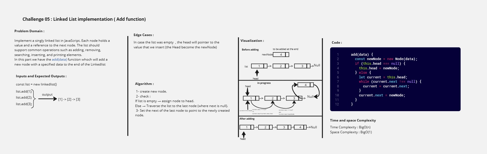
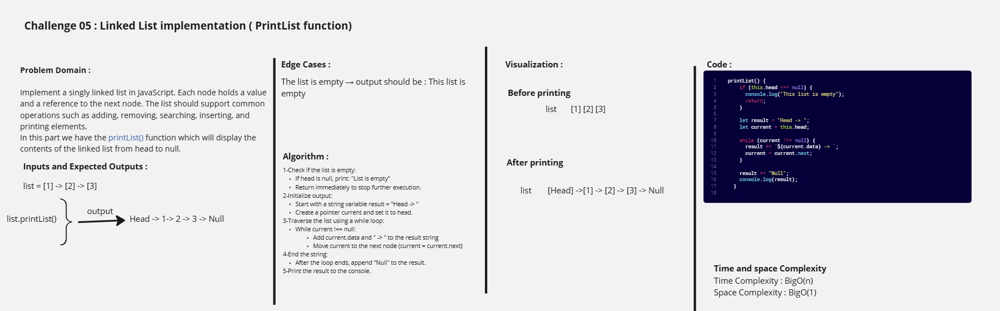
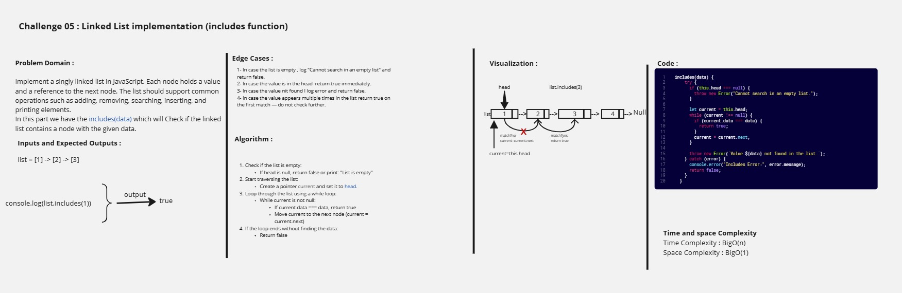
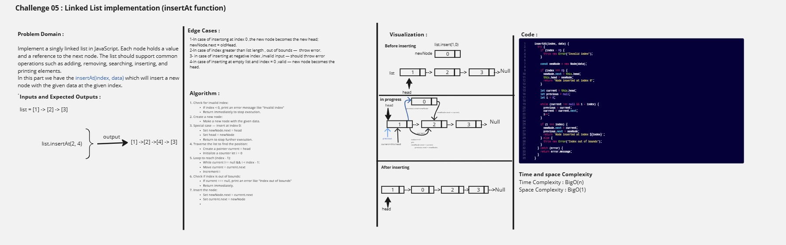
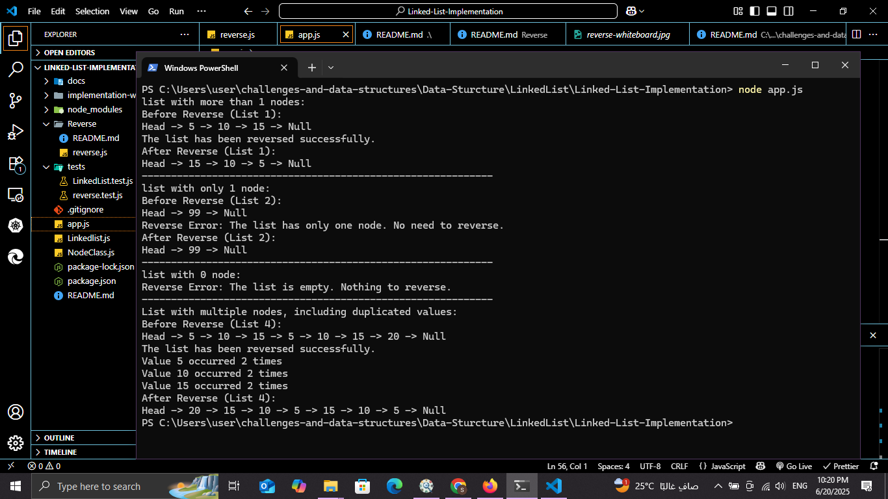

# Challenge 05 : Linked List Implementation

## Challenge 05 - Part 1: `add()` Function whiteboard image

### Whiteboard image 

---

## Challenge 05 - Part 2: `remove()` Function whiteboard image

### Whiteboard image 

---

## Challenge 05 - Part 3: `printList()` Function whiteboard image

### Whiteboard image 

---

## Challenge 05 - Part 4: `includes()` Function whiteboard image

### Whiteboard image 

---

## Challenge 05 - Part 5: `insertAt()` Function whiteboard image

### Whiteboard image 

---

## Challenge 06 - `reverseLinkedList(linkedList)` Function whiteboard image

### Whiteboard image 

---

## Challenge 07 - `mergeSortedLists(list1, list2)` Function whiteboard image

### Whiteboard image 

---

## Challenge 08 - `rotateLeft(head, k)` Function whiteboard image

### Whiteboard image 

---

## Console Output for implementation part

---

## Console Output for reverse part

---

## Console Output for merge Sorted lists part

---

## Console Output for rotate left part

