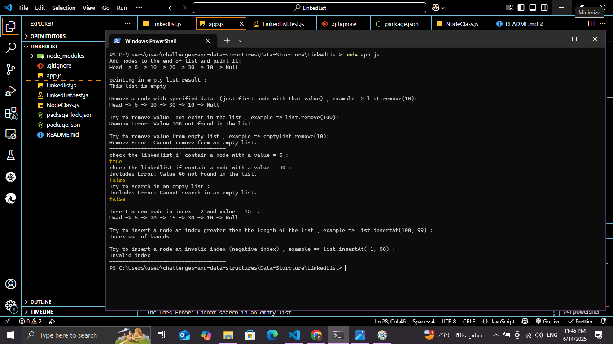

# Challenge 05 : Linked List Implementation

## Challenge 05 - Part 1: `add()` Function whiteboard image

### Whiteboard image 

---

## Challenge 05 - Part 2: `remove()` Function whiteboard image

### Whiteboard image 

---

## Challenge 05 - Part 3: `printList()` Function whiteboard image

### Whiteboard image 

---

## Challenge 05 - Part 4: `includes()` Function whiteboard image

### Whiteboard image 

---

## Challenge 05 - Part 5: `insertAt()` Function whiteboard image

### Whiteboard image 

---

## Console Output

