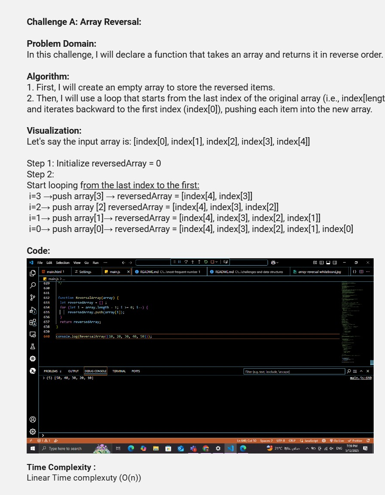
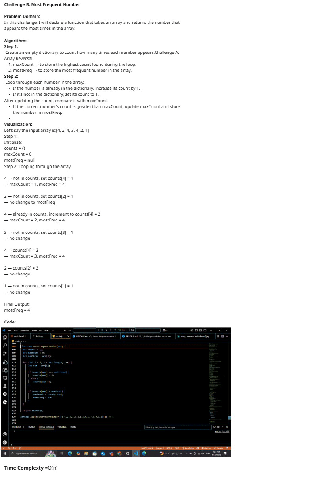
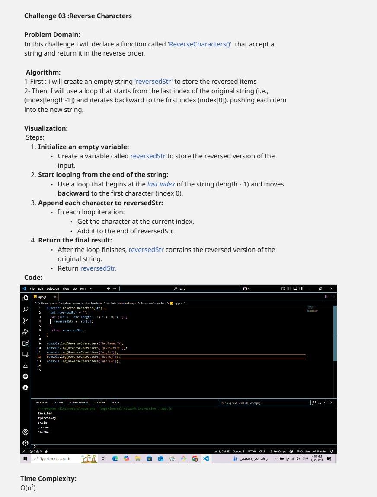

# Challenges and Data Structures

## Whiteboard Images

### Challenge 1- A: Array Reversal

### Challenge 1- B: Most Frequent Number

### challenge 2- Minimum Value

### challenge 3- Reverse Characters

