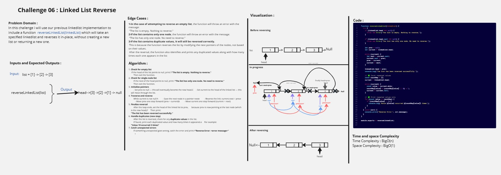
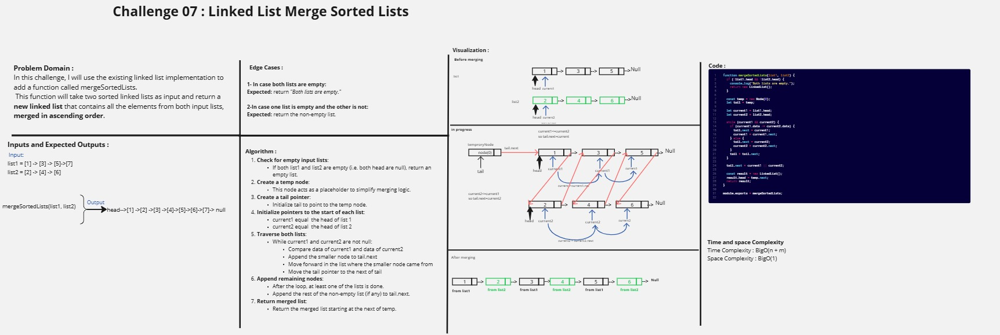
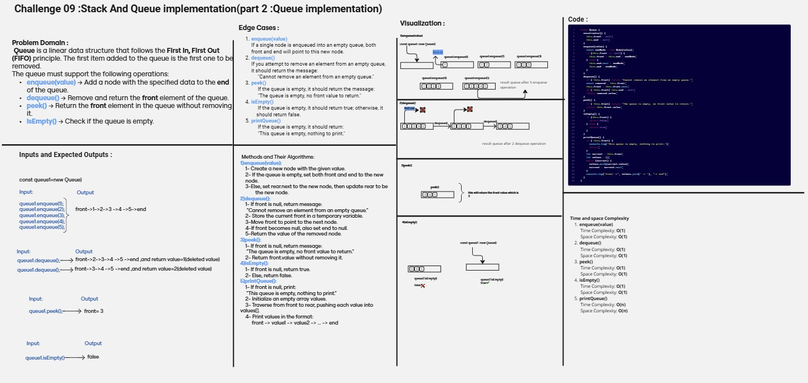
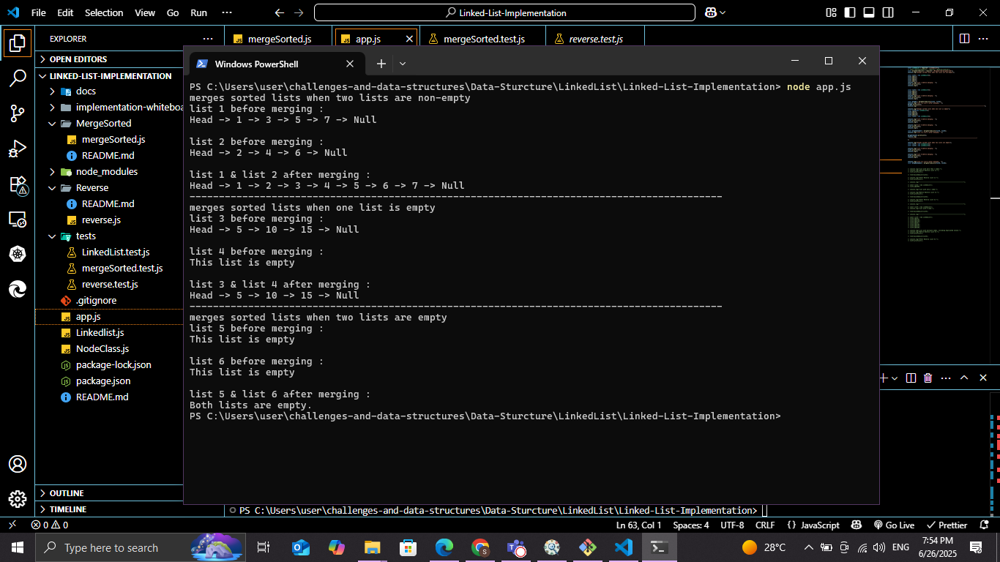

# Challenges and Data Structures

## Whiteboard Images

### Challenge 1- A: Array Reversal

### Challenge 1- B: Most Frequent Number

### challenge 2- Minimum Value

### challenge 3- Reverse Characters

### challenge 4- Remove Middle Value

### Challenge 05 : Linked List Implementation

## Challenge 05 - Part 1: `add()` Function whiteboard image

### Whiteboard image 

---

## Challenge 05 - Part 2: `remove()` Function whiteboard image

### Whiteboard image 

---

## Challenge 05 - Part 3: `printList()` Function whiteboard image

### Whiteboard image 

---

## Challenge 05 - Part 4: `includes()` Function whiteboard image

### Whiteboard image 

---

## Challenge 05 - Part 5: `insertAt()` Function whiteboard image

### Whiteboard image 

---

## Challenge 06 - `reverseLinkedList(linkedList)` Function whiteboard image

### Whiteboard image 

---

## Challenge 07 - `mergeSortedLists(list1, list2)` Function whiteboard image

## Whiteboard image 

---

## Challenge 08 - `rotateLeft(head, k)` Function whiteboard image

## Whiteboard image 

## Challenge 09 - Stack and Queue implementation

## part1 - Stack implementation

## Whiteboard image 

## Part2 - Queue implementation

## Whiteboard image 

---

## Challenge 10 - Delete Middle Element of a Stack

## Whiteboard image 

---

## Console Output Images

## Console Output for implementation part (Challenge 5 )

---

## Console Output for reverse part (Challenge 6 )

---

## Console Output for merge Sorted lists part (Challenge 7 )

---

## Console Output for rotate left part (Challenge 8 )

---

## Console Output for Stack And Queue implementation (Challenge 9)

## Console Output for Stack implementation part

## Console Output for Queue implementation part

---

## Console Output for Delete Middle Element of a Stack

