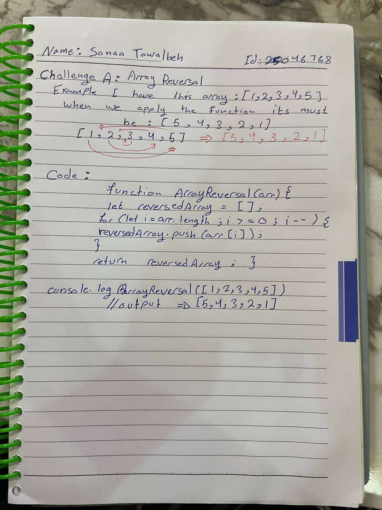

# Challenge A: Array Reversal

## Description

Create a function named "array_reversal" that accepts an array as its parameter. Without using any built-in methods, return a new array where the elements are in the reverse order.

## Example

| Input               | Output               |
|---------------------|----------------------|
| [1, 2, 3, 4, 5]     | [5, 4, 3, 2, 1]      |
| [42, 8, 15, 23, 42] | [42, 23, 15, 8, 42]  |
| [7, 9, 13, 25]      | [25, 13, 9, 7]       |

## Whiteboard Image

