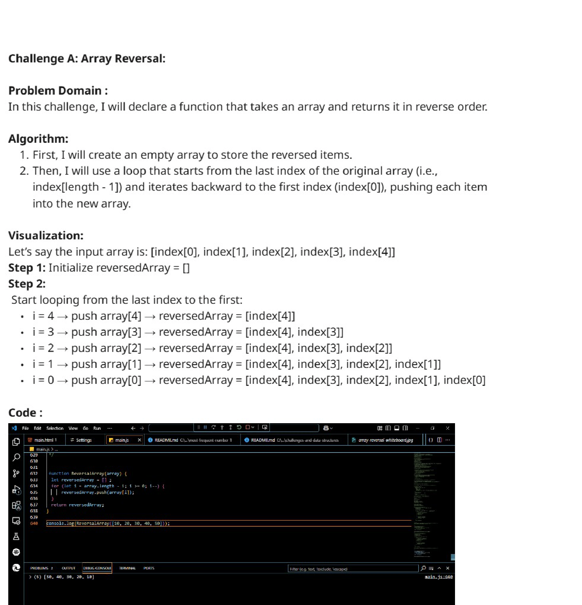
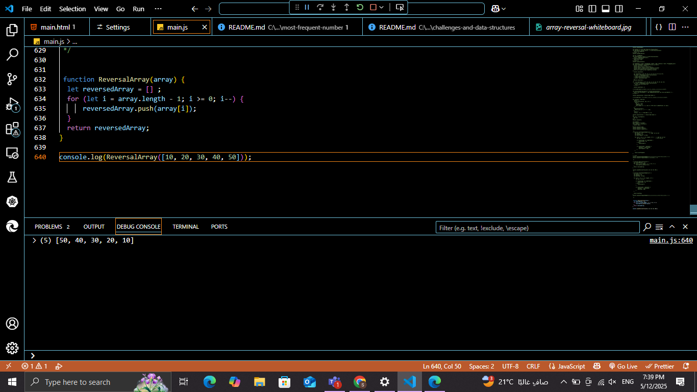

# Challenge A: Array Reversal

## Description

Create a function named "array_reversal" that accepts an array as its parameter. Without using any built-in methods, return a new array where the elements are in the reverse order.

## Whiteboard

## Whiteboard-Image

