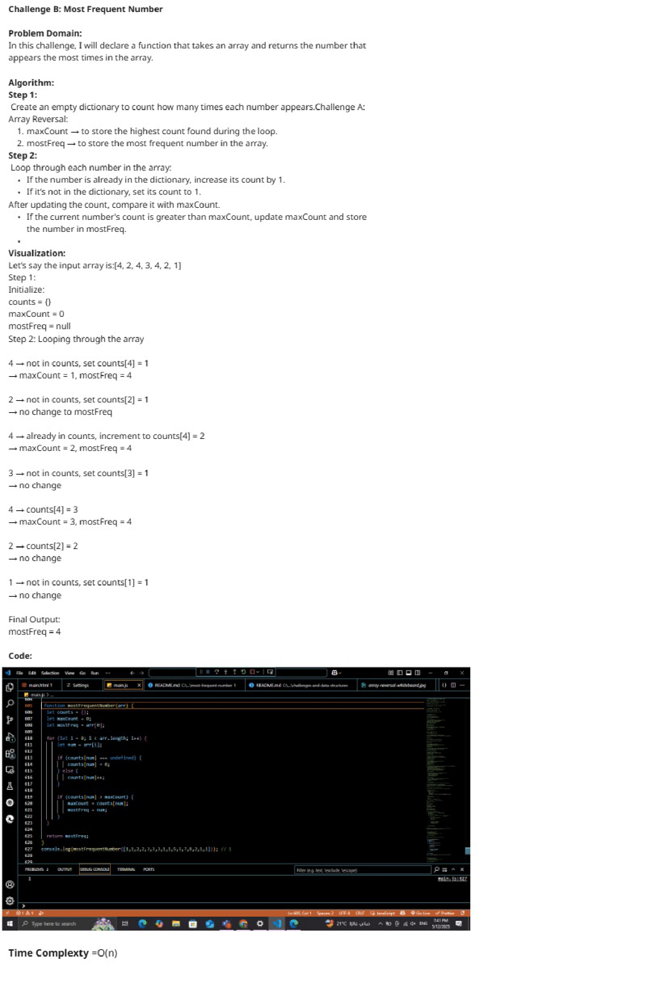
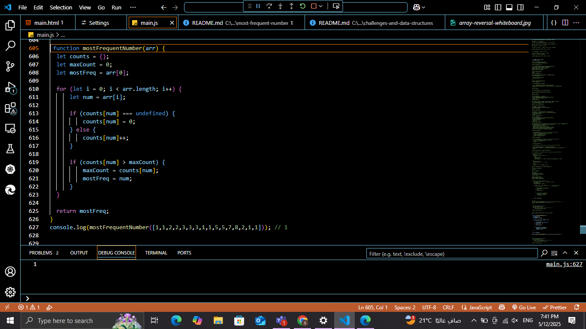

# Challenge B: Most Frequent Number

## Description

Write a method that takes an integer array and returns the number that appears the most times. If there are no duplicates, return the first number in the array. If more than one number shows up the same number of times, return the first found.

## Whiteboard

## Whiteboard Image

